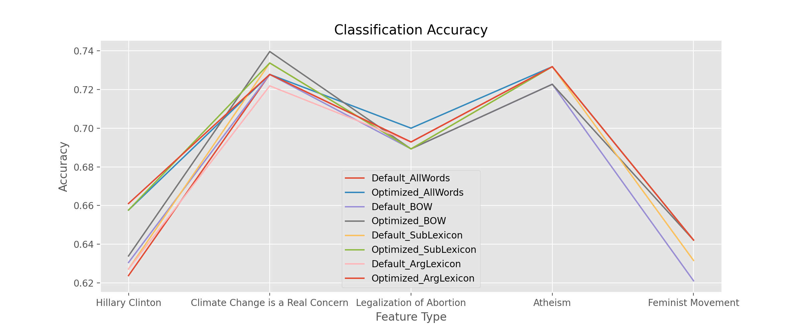

<!--

 * @Date: 2021-11-09 11:26:11
 * @LastEditors: yuhhong
 * @LastEditTime: 2021-12-14 14:52:19
-->
# L545-B659-Final-Project

Indiana University, Bloomington

## Set Up

Please install the following packages: 

- python=3.5
- numpy
- pandas
- scikit-learn
- nltk
- treetaggerwrapper
- matplotlib

Tips: 

1. NLTK is not suitable for Python 3.7.

2. Remember to add the path to treetagger to your environment variables. 

## Performance

Here is the plot of all the performances. The optimized arguing lexicons perform best on most of the targets. 

## Baseline

- In the baseline, all the tweets have been preprocessed, and all the words are used as the feature. We could compare new features from PartA, PartB, PartC and PartD with this baseline, then decide what are the features will be used in our final model. 

| Target                           | Default_BOW | Optimized_BOW |
| -------------------------------- | ----------- | ------------- |
| Hillary Clinton                  | 0.6237      | 0.6576        |
| Climate Change is a Real Concern | 0.7278      | 0.7278        |
| Legalization of Abortion         | 0.6928      | 0.7000        |
| Atheism                          | 0.7318      | 0.7318        |
| Feminist Movement                | 0.6421      | 0.6421        |

## Part A

- Extract a bag-of-words list of nouns, adjectives, and verbs for all targets individually. Then create feature vectors for all training and test data (separately) for all targets.
- Perform classification using Support Vector Machines (SVM) and default settings. 
- Improve the results when optimize the settings. In `explore_SVM_settings.ipynb`, the 'Hillary Clinton' is used as an example aiming to explore the affect of each parameter of SVM. Then we get a general step of adjust SVM settings and optimized them for different targets one by one in `a.py`. The general steps are: 
	- Check that which kernel performance best with their default related parameters. 
    In most of the situations, it is linear kernel or RBF kernel. If the dimension of feature is large enough compare to the number of samples, the data can be linearly seperatable in high dimensionality, the linear kernel will performance great and fast. If the dimension of feature is not large enough, the RBF kernel could be a good choice. 
	- Adjust the regularization parameter. 
	- Check that whether a balanced class weight need to be used. 

| Target                           | Default_BOW | Optimized_BOW |
| -------------------------------- | ----------- | ------------- |
| Hillary Clinton                  | 0.6305      | 0.6339        |
| Climate Change is a Real Concern | 0.7278      | 0.7396        |
| Legalization of Abortion         | 0.6893      | 0.6893        |
| Atheism                          | 0.7227      | 0.7227        |
| Feminist Movement                | 0.6211      | 0.6421        |

### Part B

- Then extend your data set to include features using the [MPQA Subjectivity lexicon](http://mpqa.cs.pitt.edu/lexicons/subj_lexicon/). Decide on a good way of using this information in features. Explain your reasoning. How do the results change? 

- Can you use the [Arguing Lexicon](http://mpqa.cs.pitt.edu/lexicons/arg_lexicon/)? Do you find occurrences of the listed expressions? How do you convert the information into features? How do these features affect classiffcation results?

| Target                           | Default_SubLexicon | Optimized_SubLexicon | Default_ArgLexicon | Optimized_ArgLexicon |
| -------------------------------- | ------------------ | -------------------- | ------------------ | -------------------- |
| Hillary Clinton                  | 0.6271             | 0.6576               | 0.6271             | 0.6610               |
| Climate Change is a Real Concern | 0.7337             | 0.7337               | 0.7219             | 0.7278               |
| Legalization of Abortion         | 0.6893             | 0.6893               | 0.6929             | 0.6929               |
| Atheism                          | 0.7318             | 0.7318               | 0.7318             | 0.7318               |
| Feminist Movement                | 0.6316             | 0.6421               | 0.6421             | 0.6421               |

### Part C

- Parse your training and test data using MALTparser and the predifined model. Then extract dependency triples form the data (word, head, label) and use those as features for the stance detection task instead of the bag-of-words model. How does that affect the results? 

### Part D

- What happens if you use all words ONLY as features?
- What happens when you use bi-grams along with unigrams as features?
- What happens when you use uni-grams, bigrams and trigrams as features?

*Note: You will have to use TF-IDF vectorizer for feature selection in this part*

| Target                           | Default_Unigram | Default_Uni-Bigram | Default_Uni-Bi-Trigram |
| -------------------------------- | --------------- | ------------------ | ---------------------- |
| Hillary Clinton                  | 0.5898          | 0.5831             | 0.5831                 |
| Climate Change is a Real Concern | 0.6982          | 0.7337             | 0.7396                 |
| Legalization of Abortion         | 0.7036          | 0.6750             | 0.6786                 |
| Atheism                          | 0.7273          | 0.7273             | 0.7273                 |
| Feminist Movement                | 0.6351          | 0.6561             | 0.6491                 |
